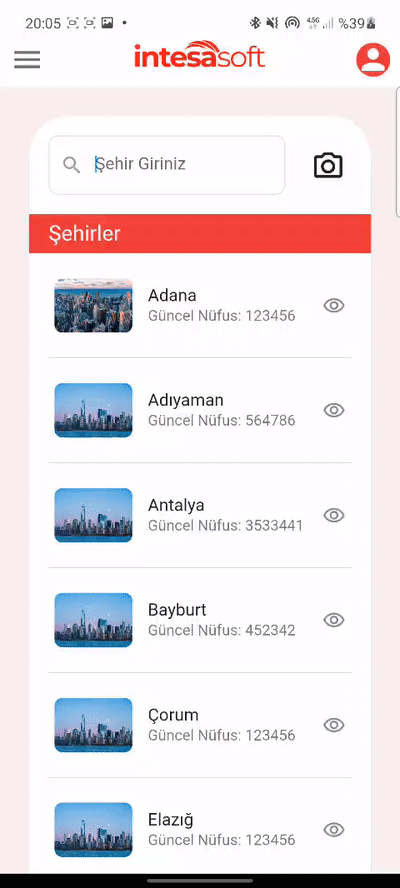
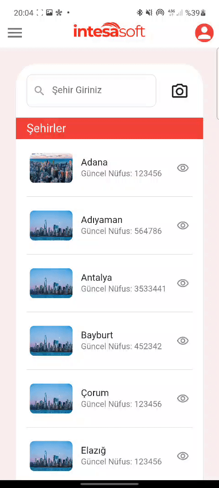
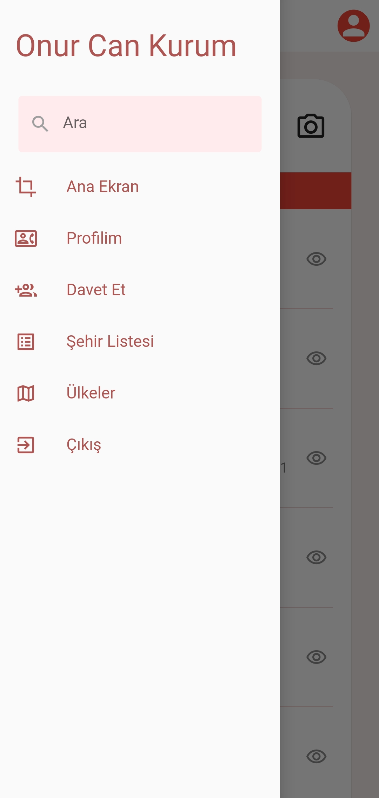

# API & MVVM Example App
provider package used for state management and MVVM architecture <br>
dio package used for http requests
## to install and run this project, run these commands step by step

```cmd
git clone https://github.com/onurcankurum/intesasoft_api_case.git
flutter pub get
flutter run
```
## screen views
<p align="center">
  




</p>
<br>


